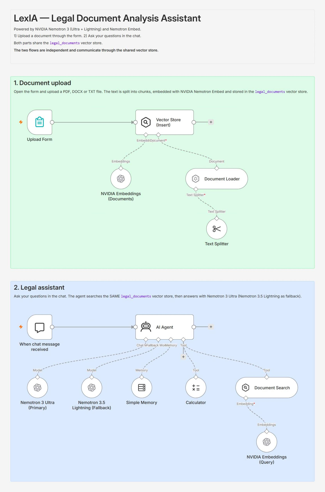
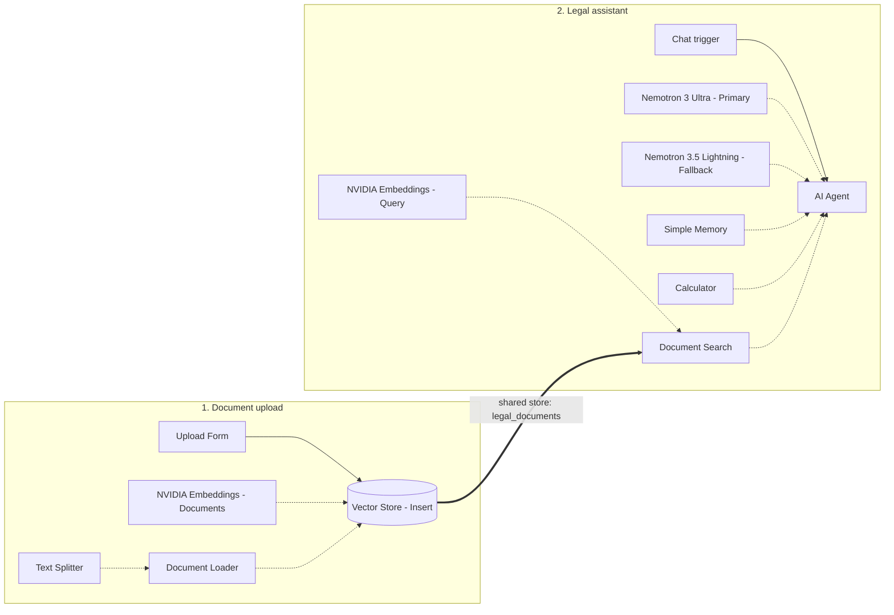

# LexIA — Legal Document Analysis Assistant

An n8n workflow that lets you upload legal or administrative documents and ask questions about them in a chat. Answers are grounded in the uploaded documents and cite their sources. It is built on NVIDIA Nemotron models.

> **Disclaimer:** LexIA helps you understand documents. It does not provide legal advice and does not replace a lawyer or legal professional.

## Features

- **Document upload form**: accepts PDF, DOCX and TXT files.
- **Retrieval-augmented generation (RAG)**: documents are split into chunks, embedded with NVIDIA Nemotron Embed and stored in a vector store.
- **AI agent with tools**:
  - document search (`legal_documents` tool)
  - calculator for notice periods, penalties, amounts and deadlines
  - conversation memory (last 10 messages)
- **Model fallback**: Nemotron 3 Ultra is the primary model, and Nemotron 3.5 Lightning takes over if it fails.
- **Source citations**: answers cite the document and the relevant passage. The agent says so when the information is not in the document.
- **Multilingual**: the agent answers in the language of the question (for example English or French).
- **Structured analysis**: when asked to analyze a document, the agent returns its type, parties, key dates, amounts, obligations, termination conditions and sensitive clauses, each clause with a risk level.

## Architecture

The workflow has two independent flows. They share the same vector store (`legal_documents`) and are not connected by a wire.

| Component | Node | Model or setting |
|---|---|---|
| Chat model (primary) | OpenAI Chat Model | `nvidia/nemotron-3-ultra-550b-a55b` |
| Chat model (fallback) | OpenAI Chat Model | `nvidia/nemotron-3.5-lightning-30b-a3b` |
| Embeddings | Embeddings OpenAI | `nvidia/nemotron-3-embed-1b` |
| Vector store | Simple Vector Store (in memory) | key `legal_documents`, top K = 6 |
| Text splitter | Recursive Character Text Splitter | chunk size 1200, overlap 200 |

The NVIDIA API is compatible with the OpenAI API, so the standard n8n OpenAI nodes connect to it through a custom base URL.

## Requirements

- An n8n instance (n8n Cloud or self-hosted) with the LangChain AI nodes.
- A free NVIDIA API key from [build.nvidia.com](https://build.nvidia.com).

## Setup

1. **Import the workflow**: in n8n, go to *Workflows → Import from File* and select `lexia-legal-document-assistant.json`.
2. **Create the NVIDIA credential**: open any NVIDIA node, then *Credential → Create new credential* (type **OpenAI**):
   - **API Key**: your NVIDIA key (`nvapi-...`)
   - **Base URL**: `https://integrate.api.nvidia.com/v1`
3. **Assign the credential** to the four NVIDIA nodes:
   - Nemotron 3 Ultra (Primary)
   - Nemotron 3.5 Lightning (Fallback)
   - NVIDIA Embeddings (Documents)
   - NVIDIA Embeddings (Query)
4. Save the workflow.

## Usage

1. Click **Execute workflow** and upload a document through the form.
2. Click **Open chat** and ask a question, for example:
   - "What is the tenant's notice period?"
   - "Analyze this contract and list the sensitive clauses."
   - "Calculate the penalty for 15 days of delay."

For public use, activate the workflow and enable *Make Chat Publicly Available* in the chat trigger.

## Limitations

- **Data is not persistent**: the Simple Vector Store keeps data in memory, so uploaded documents are lost when n8n restarts. For production, replace it with a persistent store such as Qdrant, Pinecone, Supabase or PGVector. Keep the same embedding model.
- **Privacy**: document content is sent to the NVIDIA API. Test only with public or fictitious documents.
- **Not legal advice**: answers can contain errors. Always check important points with a professional.

## Security

No API key is stored in this repository. The workflow file only references a credential name (`NVIDIA NIM`), and you create your own credential after importing.
